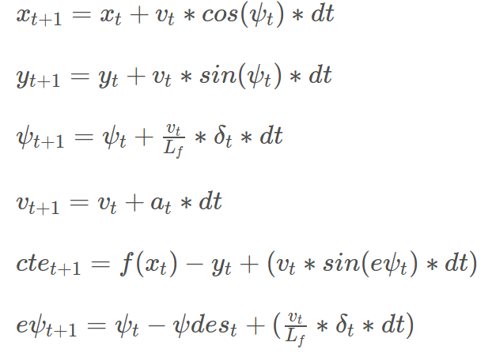

# Writeup: CarND-MPC-Project

## Model
Model Predictive Control refrains the task of a car fallowing a trajectory as an optimization problem. As stated at the start of lesson 19 "the solution of the optimization problem is the optimal trajectory". The car model is a simplified version of a dynamic model that ignores tire forces, gravity and mass. This model is also know as Kinematic model.

## Model state
In the Udacity simulator the state of the model is represented by the following vector [x, y, psi, v, cte, epsi] where:
- x is the position on the horizontal axis
- y is the position on the vertical axis
- psi is the orientation
- v is the velocity
- cte is the cross track error
- espi is hte orientation error

## actuators
The model also uses to actuators
- delta is the steering angle
- throttle is the acceleration

## State at time t+1

Considering that wee know the state at time "t" using the following equations wee can predict the state of the model at time t+1:



## Parameters Tuning
The most obvious parameters that you can play with in order to tune the controller are
- N (the number of time steps)
- dt (delay time)
- ref_v (the reference velocity or target speed)

The problem was to deal with 100 milliseconds delay so I started from start to work with delay times of 0.1. I'm still not sure that this reasoning is valid but tweaking the speed and the number of points I was able to get to a decent result.
Initially I have tried with N = 25 and speed 40. I got good results with this setup but I wanted more. I started increasing the speed and noticed that my laptop is not fast enough in order to compute in time the trajectory when setting the system close to 80Km/h. By the time I dropped the points to 10 I was able to speed up to 130 Km/h. Still at that speed the car was dangerous getting close to jump off the track. Setting the speed to 100 and the points to 10 proved in the end that it traveled fast enough for my ego and also was never getting out of the legal edge of the road.


## Polynomial Fit
The polynomial fit is happening in main.cpp. The code was provided by the project. I have chosen from the start to fit a 3rd degree polynomial. The 3rd order polynomial was the first thing that I have tried. The graph of the level 3 provides suficinet space where the care can turn in emergency situations and redress after it saved the situation and also it can quite nicely follow a smood curve. Allso as suggested by the slack buddies the values of the x and y are transformed so wee fit all the time in the first trigonometric cadran.

```
// Convert waypoints from map coordinates to car's local cordinates
Eigen::VectorXd ptsx_trans = Eigen::VectorXd(ptsx.size());
Eigen::VectorXd ptsy_trans = Eigen::VectorXd(ptsy.size());

for (int i = 0; i < ptsx.size(); i++) {
    ptsx_trans[i] = (ptsx[i] - px) * cos(psi) + (ptsy[i] - py) * sin(psi);
    ptsy_trans[i] = (ptsy[i] - py) * cos(psi) - (ptsx[i] - px) * sin(psi);
}

// Fit polynomial
Eigen::VectorXd coefficients = polyfit(ptsx_trans, ptsy_trans, 3);
```

## Model Predictive Control with Latency
In a real situation the actual actuators won't provoke and instant response. It takes time until the actuators signal gets propagated into the car system. An MPC model can deal with this type of problems quite nicely. The MPC model can predict ahead accounting for this type of latency. In our case it was impose by the problem to predict ahead accounting for 100 ms latency.

```
// Predict ahead accounting for latency
px = px + v * cos(psi) * latency;
py = py + v * sin(psi) * latency;
psi = psi - v * steer_value / Lf  * latency;
v = v + throttle_value * latency;
```
